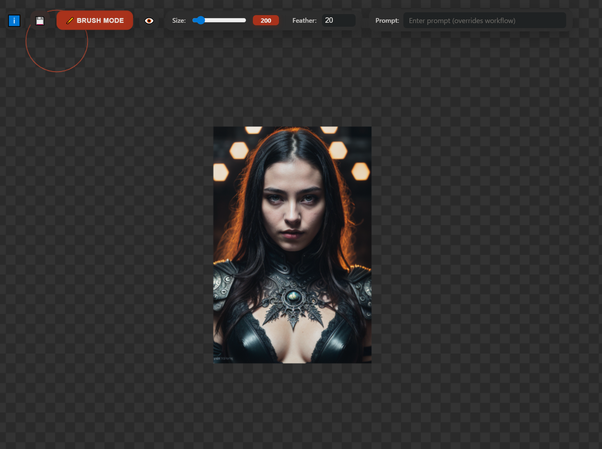

# 🎨 ComfyUI Infinity Canvas

A powerful infinite canvas inpainting extension for ComfyUI, inspired by the intuitive workflows of **InvokeAI Canvas** and **Painthua.com**.



## 🌟 Vision & Intention

This extension reimagines AI-powered image generation by bringing an **infinite canvas** paradigm to ComfyUI. Unlike traditional fixed-canvas approaches, Infinity Canvas enables artists and creators to:

- **Paint freely** without canvas boundaries
- **Iterate endlessly** with seamless inpainting workflows
- **Build compositions organically** by expanding in any direction
- **Maintain creative flow** with intuitive mask painting tools

### Inspiration

Drawing from the best features of industry-leading tools:

**InvokeAI Canvas** - The seamless unified canvas experience where generation and editing feel natural  
**Painthua.com** - The fluid, responsive drawing interface that puts creative control first

Infinity Canvas combines these philosophies into a ComfyUI-native extension that feels both powerful and effortless.

## ✨ Features

### 🖌️ Infinite Canvas
- **Boundless workspace** - Pan, zoom, and create without limits
- **Tile-based rendering** - Efficient memory management for massive compositions
   - Tile placement drives inference context: when using tile mode, each tile's position on the canvas is used to set the inference context. Users manually place tiles to define where and how the model should generate content — a powerful, explicit way to control contextual inpainting.
- **Smooth performance** - Optimized rendering pipeline for fluid interaction

### 🎭 Intelligent Masking
- **Brush mode** - Paint masks exactly where you want generation to occur
- **Eraser mode** - Refine masks with precision
- **Adjustable brush size** - From fine details to broad strokes (5-200px)
- **Feathering control** - Smooth blending between generated and existing content
- **Real-time preview** - See your mask as you paint

### 🤖 AI-Powered Inpainting
- **Prompt-based generation** - Natural language descriptions for precise control
- **Context-aware** - Uses surrounding image content for coherent results
- **Iterative refinement** - Generate, adjust mask, regenerate - endless creative cycles
- **Progress tracking** - Real-time feedback during generation

### 🎯 Advanced Controls
- **Multiple output sizes** - Preset dimensions (512x512 to 1024x1024) or custom sizes
- **Mask visibility toggle** - Show/hide your mask layer while working
- **Undo/Redo support** - Non-destructive workflow with full history (50 levels)
- **Drag & drop** - Import existing images to extend or modify
- **Clipboard support** - Paste images directly onto the canvas

### 🎨 Professional Interface
- **Draggable launcher** - Position the canvas button wherever you prefer
- **Modern UI** - Clean, distraction-free workspace
- **Keyboard shortcuts** - Efficient workflow for power users
- **Persistent settings** - Your preferences saved between sessions

## 🚀 Installation

1. Navigate to your ComfyUI custom nodes directory:
```bash
cd ComfyUI/custom_nodes
```

2. Clone this repository:
```bash
git clone https://github.com/yourusername/ComfyUI-Infinity-Canvas.git
```

3. Restart ComfyUI

4. Look for the **🎨 Infinity Canvas** button in the ComfyUI interface

## 📖 Usage Guide

### Getting Started

1. **Launch the Canvas**
   - Click the "🎨 Infinity Canvas" button in ComfyUI
   - The canvas window will open in a new tab/window

3. **Choose Your Mode**
   - **Brush Mode** 🖌️ - Paint areas where you want AI to generate content
   - **Erase Mode** ✏️ - Remove or refine mask areas
   - **Tile Mode** 🧩 - Adjust the tile size for generation (512-1024px)
     - Note: In Tile Mode, inference is created based on the tile's placement — the tile defines the inference context. You set the context manually by where you place tiles on the canvas, enabling precise, contextual inpainting and powerful control over how generated content blends with surrounding areas.

3. **Create Your Mask**
   - Select Brush mode
   - Adjust brush size with the slider
   - Paint over areas you want to inpaint
   - Use feathering (0-50px) for softer edges

4. **Generate Content**
   - Enter your prompt in the text field
   - Click "Generate" or press Enter
   - Watch as AI fills your masked region

5. **Refine & Iterate**
   - Adjust the mask if needed
   - Change your prompt for variations
   - Generate again - infinite iterations!

### Workflow Tips

**Building Compositions**
- Start with a small generated tile
- Paint masks extending outward
- Generate adjacent sections with prompts that match the context
- Pan and zoom to find the perfect composition

**Fixing Details**
- Use a small brush (5-20px) for precise mask painting
- Add feathering for seamless blends
- Iterate with slightly different prompts for variations

**Expanding Images**
- Drag & drop or paste an existing image
- Paint masks beyond the edges
- Describe what should extend into the new area
- Generate to expand your canvas

### Info Button

- **Node prerequisites (info text):** The node expects a `Load Image` node configured to provide a `Save Image` output into the Infinity Canvas flow. If the expected `Load Image` → `Save Image` setup is not present, the node cannot correctly target a preloaded tile and will instead paste any output the inference sends directly onto the canvas. This fallback behavior may produce unexpected placements or duplicated outputs — ensure your node graph includes a `Load Image` with `Save Image` when you want inferences to be written into existing tiles.

### Keyboard Shortcuts

- **Ctrl/Cmd + Z** - Undo
- **Ctrl/Cmd + Y** - Redo  
- **Ctrl/Cmd + V** - Paste image from clipboard
- **Space + Drag** - Pan canvas
- **Mouse Wheel** - Zoom in/out

## 🛠️ Technical Details

### Architecture

The extension consists of three main components:

**Frontend Canvas (`script.js`)**
- Infinite pan/zoom viewport
- Real-time mask painting
- WebSocket communication for generation feedback
- Undo/redo state management
- Efficient tile-based rendering

**Extension Integration (`extension.js`)**
- ComfyUI app lifecycle integration
- Draggable button with position persistence
- Window management and state preservation

**Python Backend (`__init__.py`)**
- Minimal backend - leverages existing ComfyUI workflows
- Web directory registration for static assets

### Performance Optimizations

- **Canvas pooling** - Reuses canvas elements for mask operations
- **Throttled rendering** - Limits draw calls during painting
- **Debounced resize** - Smooth window size adjustments
- **WebSocket reconnection** - Automatic recovery from connection drops

### Compatibility

- **ComfyUI** - Requires modern ComfyUI installation
- **Browsers** - Chrome, Edge, Firefox (WebSocket support required)
- **Models** - Works with any ComfyUI-compatible inpainting model

## 🎯 Use Cases

**Concept Artists**
- Rapid ideation and exploration
- Extending compositions beyond initial bounds
- Iterative refinement of details

**Digital Painters**
- AI-assisted painting workflows
- Texture and pattern generation
- Background expansion

**Photo Editors**
- Content-aware fill with AI
- Object removal and replacement
- Image extension and uncropping

**Game Developers**
- Seamless texture tile creation
- Procedural environment generation
- Asset iteration and variation

## 🤝 Contributing

Contributions are welcome! This project aims to make infinite canvas inpainting accessible and intuitive for all ComfyUI users.

### Development

```bash
# Clone the repository
git clone https://github.com/yourusername/ComfyUI-Infinity-Canvas.git

# Make your changes to web/script.js or web/extension.js

# Test in ComfyUI
# Restart ComfyUI to reload changes
```

### Roadmap

- [ ] Layer system for organizing masks and images
- [ ] Custom model selection within the interface
- [ ] Advanced brush patterns and shapes
- [ ] Collaborative canvas (multi-user)
- [ ] Export options (PSD, layers, etc.)
- [ ] Hotkey customization
- [ ] Touch/stylus pressure sensitivity

## 📜 License

MIT License - see LICENSE file for details

## 🙏 Acknowledgments

- **InvokeAI** - For pioneering the unified canvas approach
- **Painthua.com** - For inspiration on fluid drawing interfaces
- **ComfyUI** - For the powerful foundation and extensibility
- **The AI Art Community** - For continuous feedback and innovation

## 📞 Support

- **Issues** - Report bugs or request features via GitHub Issues
- **Discussions** - Share your creations and workflows
- **Discord** - Join the ComfyUI community for real-time help

---

**Made with ❤️ for the ComfyUI community**

Transform your creative workflow - one infinite canvas at a time.
